# Otobokhly (Recipe App)

This was my graduation project and the first big project after learning Flutter. Otbokhly was implemented by using Firebase authentication to store user credentials and using Firestore to store the user's favorite recipes. Spoonacular API was used to get recipe details and upload and analyze food photos provided with nutrition details and recommended recipes. Finally, users can also search and filter recipes by different categories. Whether the recipe is vegan friendly or not for different types of dishes.

## Project Motivation

I made this project because i wanted to learn flutter and to test my skills. After building this project i learned how to consume REST API and use Firestore to save user's favorite recipes.

## Technologies Used

- Dart
- Flutter
- Firebase Authentication
- Cloud Firestore
- API

 

  
Project Screenshots

  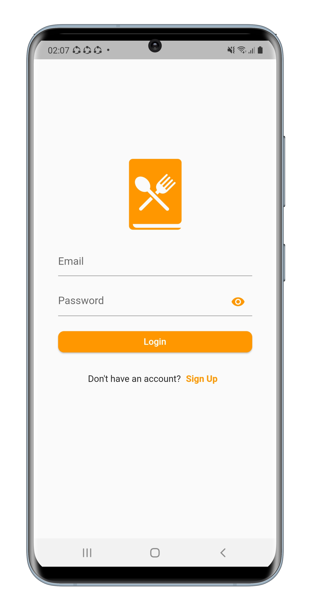
  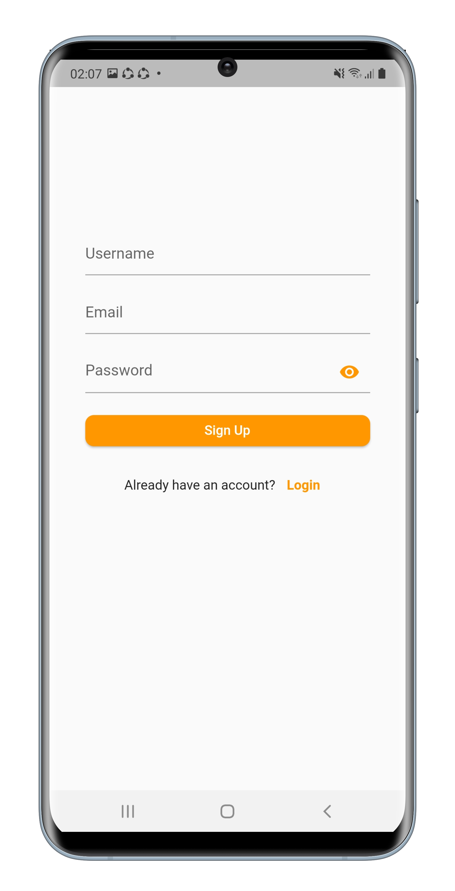
  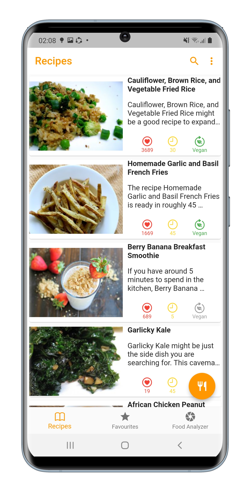
  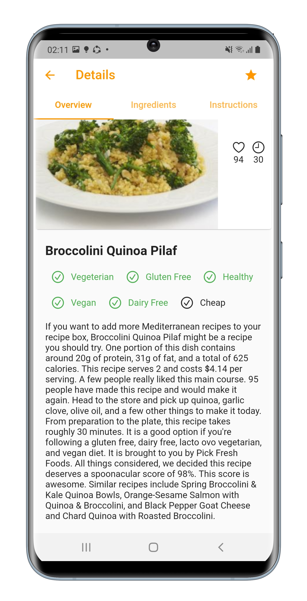
  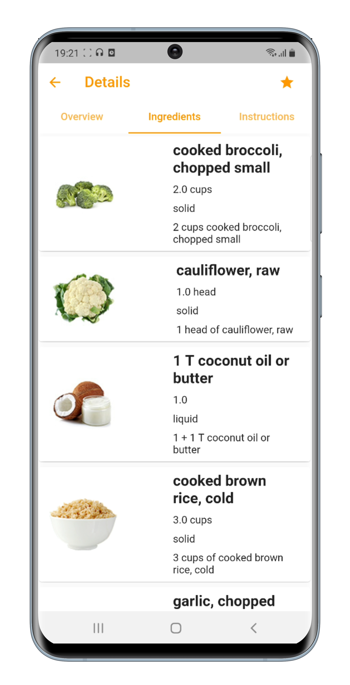
  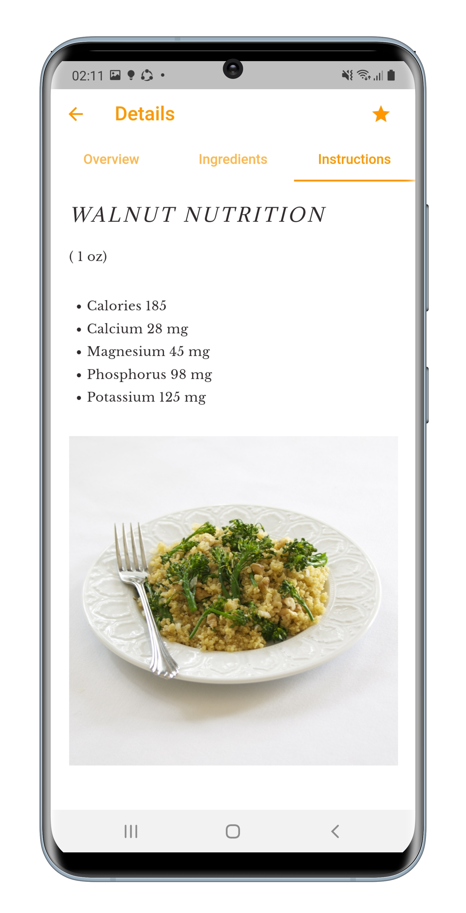
  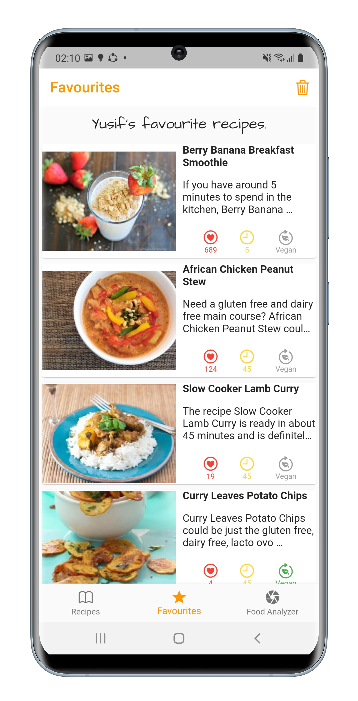
  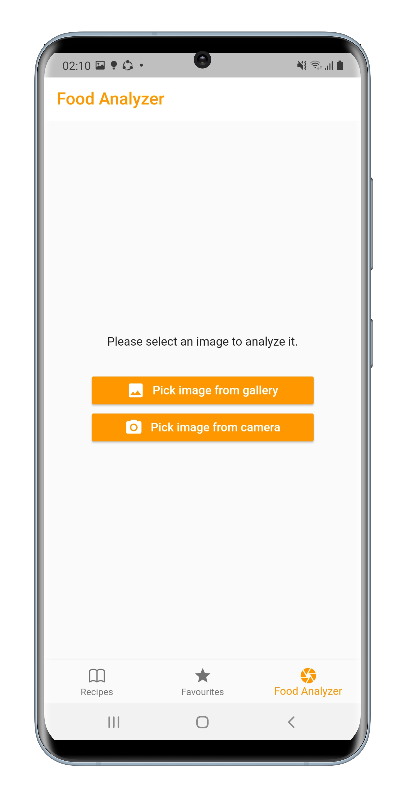
  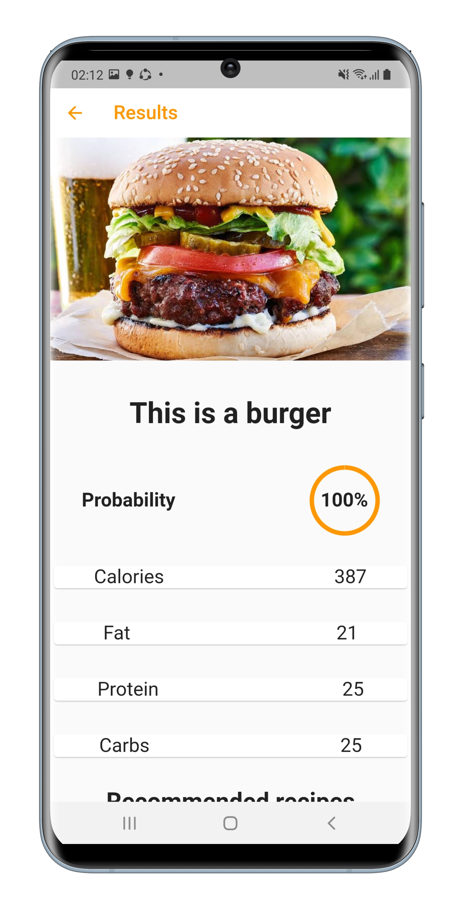
  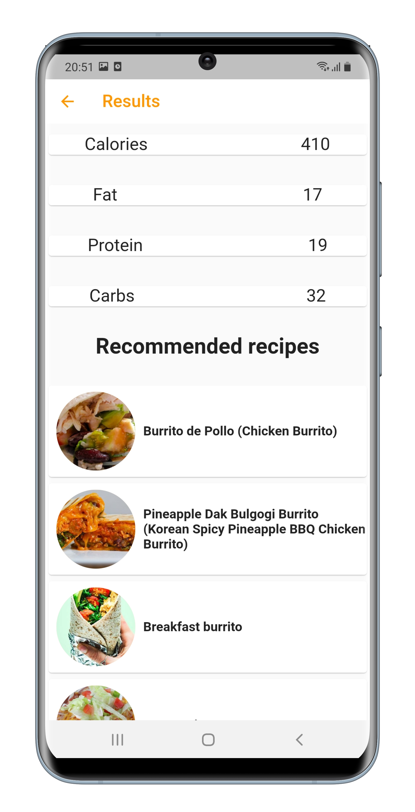
  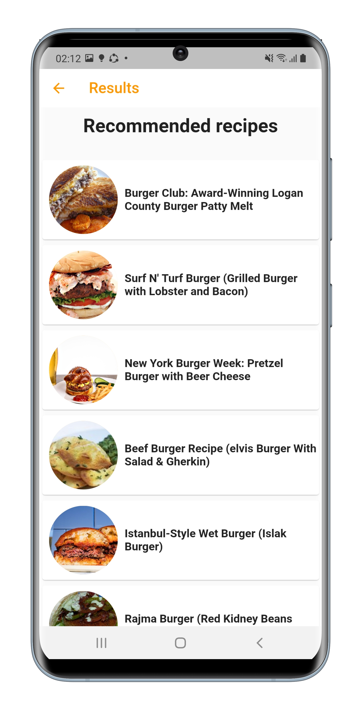

